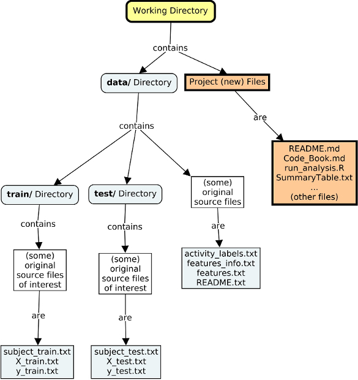
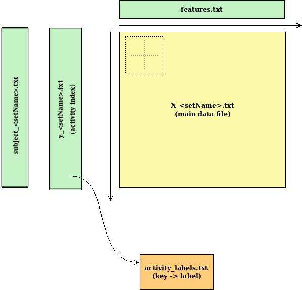

# INTRO
This document describes the main ideas behind the creation of the main  
program **run_analysis.R** which satisfies the requirements of the  
Getting and Cleaning Data Course Project.

## Getting and sorting out information
At the beginning of the course we were provided with a compressed file named  
"UCI HAR Dataset.zip". I'm working in Ubuntu/Linux, so I uncompressed the  
zip file into my working directory, and then renamed the resuting directory  
as follows:
```sh
unzip "UCI HAR Dataset.zip"
mv "UCI HAR Dataset" data
mv "UCI HAR Dataset.zip" <another-location>
```
The resulting structure of the files is shown in Fig. 1, as the blue colored  
objects.

**Figure 1.** Structure of the files (a conceptual map)



Also, in Fig. 1, I have defined the place for the new files resulting during  
the development of this project. These are shown as the orange colored  
objects.

## Understanding the structure of the data
As can be observed in Fig. 1, there are two directories "train" and "test", that  
correspond to the two data sets, namely: the training data set, and the test  
data set. Let's use these two directory names to identify the corresponding  
data sets. Since, both data sets have a similar structure, let's define a syntactic  
element, setName, as follows:
```
<setName> ::= "train" | "test".
```
Since the structure of the information in each set is similar, I will deal with  
each set, in one and the same way, with the &lt;setName&gt; as a parameter.  
Thus, taking any of the two data sets, there are as many as five files,  
that can be viewed as tables: two at the "data" directory level, and three  
at the &lt;setName&gt; directory level (see Fig. 1), as follows:

1. **activity_labels.txt**. At the "data" directory level. This can be viewed  
as two column table: the first column is a sequence of integer numbers   
starting with 1, and the second is the label of one of the six possible  
activities, like: WALKING, STANDING, etc.
2. **features.txt**. At the "data" directory level. This can be viewed  
as two column table: the first column is a sequence of integer numbers   
starting with 1, and the second is the identifier of one of the 561 measured  
features.
3. **subject_&lt;setName&gt;.txt**. At the &lt;setName&gt; directory level.  
This is a single column table, with series of repeated integer numbers  
(between 1 and 30). The number of rows of this table varies from data set  
to data set, though it matches the number of rows of the X_&lt;setName&gt;.txt  
and the y_&lt;setName&gt;.txt tables (see below). Each one of the numbers in  
this table identifies one of the individuals subjected to the measurements.
4. **y_&lt;setName&gt;.txt**. At the &lt;setName&gt; directory level.  
This is a single column table, with repeated integer numbers (between 1  
and 6). The number of rows of this table varies from data set  
to data set, though it matches the number of rows of the X_&lt;setName&gt;.txt  
and the subject_&lt;setName&gt;.txt tables. Each one of the numbers in  
this table is an index to the activity_labels.txt table, and then identifies  
one of the activities the subject is performing in a given observation.
5. **X_&lt;setName&gt;.txt**. At the &lt;setName&gt; directory level.  
This is a table, with 561 columns (Note the coincidence with the number  
of rows of the features.txt table). The number of rows of this table  
varies from data set to data set, though it matches the number of rows of  
the y_&lt;setName&gt;.txt and the subject_&lt;setName&gt;.txt tables.  
This is the main data table, and so, its entries, real numbers, represent  
the "observed" measurements.

According to the previous description, it can be concluded that the  
structure of the data, for each data set, is similar to the one  
depicted in Fig. 2.


**Figure 2.** Structure of the data overview



From this figure it can be viewed that the columns of the **X_&lt;setName&gt;.txt**  
table can be named according to the feature descriptions given in the **features.txt**  
table. Furthermore, the data lacks two columns: one for the individuals which will be   
taken from the **subject_&lt;setName&gt;.txt** table, and the other for the activities,   
each one of them performed, which will be taken in combination from tables   
**y_&lt;setName&gt;.txt** and **activity_labels.txt**.

The previous description is the key to build one similar table for each data set.  
Since, the columns of both tables agree, gluing them together in a single table  
is easy.

# Requirements of the project
From the two data sets: "train" (for training), and "test", the main program  
"run_analysis.R", have to

1. Merge the training and the test sets to create one data set.
2. Extract only the measurements on the mean and standard deviation for  
each measurement.
3. Use descriptive activity names to name the activities in the data set.                                                      
4. Appropriately label the data set with descriptive variable names.                                                        
5. From the data set in step 4, create a second, independent tidy data  
set with the average of each variable for each activity and each subject.

# The tasks of the project
To cope with these requeriments, however, and for efficiency reasons, the project  
is divided into three main tasks, namely:

- **I. BUILDING ONE DATA SET.** This comprises steps 1, 3, and,partially, step 4  
from the requirements list, because having appropriately labeled the columns  
(variables) of the data set, greatly helps to extract the information asked for  
in step 2. The names of the variables, however, will suffer a further change in  
task III, just to have column names that comply with R variable standard names.  
The step 3 of the requirements (using descriptive activity names) could be done  
here or as separate task. Since it is only substituting an index by a label,  
I opted for doing it here.
- **II. EXTRACTION OF THE MEASUREMENTS ON THE MEAN AND STANDARD  
DEVIATION FOR EACH MEASUREMENT.** This is step 2 from the requirements  
list. Here, the given variable names are used to perform this operation.
- **III. CREATION OF A SECOND, INDEPENDENT TIDY DATA SET WITH THE  
AVERAGE OF EACH VARIABLE FOR EACH ACTIVITY AND EACH SUBJECT.**  
This is step 5 from the previous list, but, as noted before, a further tranformation  
in the names of the variables (step 4 of the requirements list) is performed  
here in order to adequately specify the colum names as standard R variable  
names.

# Project results
The results of this project are given in the "SummaryTable.txt", that can be  
reloaded into a R data frame as follows:
```r
SummaryTable <- read.table("SummaryTable.txt", header=TRUE)
```
The columns of this table are described in the **Code_Book.md** document.